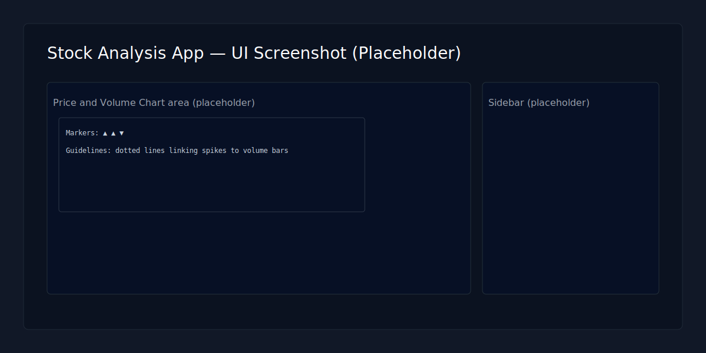
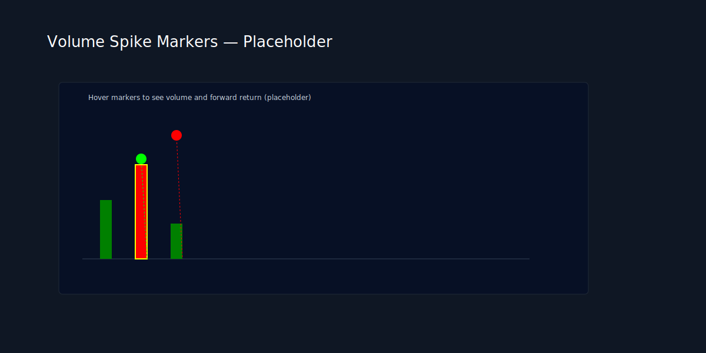

# Stock Analysis Toolkit

**Short description**

A small toolkit for fetching 5-year historical equity data using `yfinance`, analyzing volume spike patterns, and generating candlestick charts. Includes a Streamlit app (`stock_app.py`) for interactive exploration and quick fetching of new tickers.

---

## Features

- Fetch 5-year OHLCV data and save to `*_5y.csv` files (`fetch_stock_data.py`)
- Analyze volume spikes and short-term forward returns (`analyze_volume.py`)
- Generate candlestick + volume charts (`generate_charts.py`)
- Interactive Streamlit dashboard to view charts and fetch new tickers (`stock_app.py`)

---

## Requirements

- Python 3.10+ (recommended)
- Install dependencies from `requirements.txt`:

```bash
python -m venv .venv
source .venv/bin/activate
pip install -r requirements.txt
```

Note: The project uses `yfinance`, `pandas`, `plotly`, `mplfinance` and `streamlit` (for the app). See `requirements.txt` for exact versions.

---

## Quick Usage

1. Fetch the default tickers (currently `BATS.L` and `INTC`):

```bash
python fetch_stock_data.py
```

2. Analyze volume spikes across all `*_5y.csv` files in the repo:

```bash
python analyze_volume.py
```

3. Generate PNG charts (one per CSV):

```bash
python generate_charts.py
```

4. Run the interactive Streamlit app:

```bash
streamlit run stock_app.py
```

- In the Streamlit sidebar you can select an existing `*_5y.csv` file to view analysis or enter a ticker (e.g. `AAPL`, `TSLA`) and click **Fetch Data** to download and save a `TICKER_5y.csv` file.

---

## Deployment & Live App

- This project is deployed via CI/CD and the live Streamlit app is available at: https://stock-abc.streamlit.app/
- The deployment automatically publishes the latest `main` branch to the live app when CI succeeds.

---

## Screenshots

Below are two representative screenshots (placeholders) showing the app UI and volume spike markers linked to the price chart.



*Figure: Main app interface with chart area and sidebar controls.*



*Figure: Volume spike markers with dashed guideline lines connecting to volume bars.*

---

## Files overview

- `fetch_stock_data.py` — CLI script to download and save 5-year historical data for a list of tickers.
- `analyze_volume.py` — CLI analysis to detect volume spikes (20-day MA) and report short-term (e.g., 5-day) returns.
- `generate_charts.py` — Uses `mplfinance` to create candlestick charts with volume and save as PNGs.
- `stock_app.py` — Streamlit app for interactive exploration and fetching new tickers.
- `requirements.txt` — pinned Python package dependencies.
- `*_5y.csv` — CSV files produced by the fetch script (Open/High/Low/Close/Volume/Dividends/Stock Splits, indexed by Date).

---

## Troubleshooting & Notes

- If a CSV is empty or very short, the app scripts may raise errors (e.g., `iloc[-1]`). Ensure files contain at least a handful of rows.
- Network issues or rate limits from Yahoo Finance may cause fetch failures — retry or reduce fetch frequency.
- If plots appear odd, confirm the CSV has `Open`, `High`, `Low`, `Close`, and `Volume` columns and that `Date` is a parseable timestamp.

---

## Suggested Improvements

- Add CLI arguments (`argparse`) to `fetch_stock_data.py` for user-specified tickers and periods.
- Unit tests were added for spike detection logic (`tests/test_detect_spikes.py`). Run them with `pytest`.
- New UI controls: spike detection rolling window and multiplier sliders, toggles for spike markers and guideline lines, and chart exports (PNG requires `kaleido`).
- Centralize fetching logic into a reusable module to prevent duplicated code.

---

## Contributing

Contributions welcome! Please open an issue or submit a pull request. If you add code, include tests and update the README where applicable.

---

## License

No license specified. Add a `LICENSE` file (e.g., MIT) if you want to make this project open source.

---

Happy analyzing!
